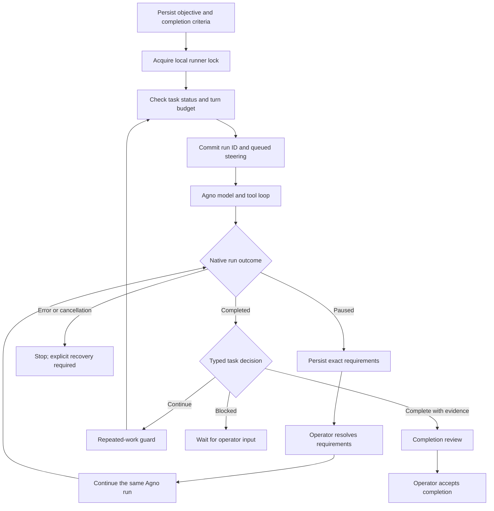

# Standalone agent loop

Research and implementation scope: October 4, 2026. This is a local coding harness using Agno, with no changes to framework internals. The comparisons below come from official documentation and the linked source snapshots, not benchmarks or executed integrations.

## What the other projects teach us

| Project | Observed architecture | What we adopt |
| --- | --- | --- |
| OpenCode v1 | A session prompt loop drives the streaming processor. The processor returns `continue`, `stop`, or `compact`, maintains tool state, applies provider retry policy, and asks permission after repeated identical tool calls. | Explicit continuation outcomes and a repeated-work guard. Our guard compares entire completed outer-turn traces, so it is less granular than v1's tool-call guard. |
| OpenCode v2 | Input admission, projected conversation history, provider-turn execution, tool settlement, and session coordination are separate. Steers enter at safe provider-turn boundaries. Interrupted tool executions receive durable failure outcomes; they are not silently replayed. Context epochs and compaction govern request assembly. | Durable admission, serialized ownership, and explicit recovery. Our safe boundary is an entire Agno run; we do not claim v2's finer steering or compaction behavior. |
| T3 Code | A control surface over existing agent providers. Its v2 orchestrator decides commands/events, the event sink commits receipts/projections/outbox effects transactionally, and workers perform external effects. Provider adapters normalize behavior. | Keep the harness and agent runtime separate. Commit task status with its corresponding task event. Full outbox execution and external provider adapters are later work. |
| Claude Agent SDK | Embeds Claude Code's runtime, tools, permissions, sessions, and hooks. The Python SDK drives a streaming transport/control protocol; it does not implement Claude Code's internal reasoning loop in ordinary Python source. | Use the runtime's native tool and approval machinery; do not build a competing tool executor. |
| Codex SDK | The TypeScript thread wrapper drives a local Codex executable and consumes typed JSON events; `run()` reduces them to a final turn. The current official documentation also describes a Python SDK using the local app-server. | Stable session identity, live events, and assembled final results. These SDKs wrap a harness; installing them is not necessary to build our Agno harness. |
| DeepSeek Harness | Cordis composes model, tool, session, loop, and other capabilities. The loop driver owns durable inbox claims and turn/step state; tool execution uses exclusive barriers or a bounded parallel pool. Recovery distinguishes unstarted calls from uncertain outcomes. | Small separated responsibilities, durable input, and conservative recovery. Tool scheduling remains Agno's responsibility in this version. |
| Prime Agent | Current source includes a Rust agent-loop implementation, with a persistent Python REPL as the model's control environment. The loop polls steering, follow-up, and continuation separately and supports stop hooks. The continual harness stores supplemental operating state. | Persist the objective across turns, admit steering at a boundary, and stop based on explicit conditions. REPL execution, recursive children, and self-refinement are separate extensions. |

### Source snapshots

- **OpenCode v1**, `907b3bc518fa48e90e8ec24dd327d13eee71c36c`: [prompt loop](https://github.com/anomalyco/opencode/blob/907b3bc518fa48e90e8ec24dd327d13eee71c36c/packages/opencode/src/session/prompt.ts), [processor](https://github.com/anomalyco/opencode/blob/907b3bc518fa48e90e8ec24dd327d13eee71c36c/packages/opencode/src/session/processor.ts).
- **OpenCode v2**, same repository snapshot: [session contract](https://github.com/anomalyco/opencode/blob/907b3bc518fa48e90e8ec24dd327d13eee71c36c/specs/v2/session.md), [runner](https://github.com/anomalyco/opencode/blob/907b3bc518fa48e90e8ec24dd327d13eee71c36c/packages/core/src/session/runner/llm.ts), [coordinator](https://github.com/anomalyco/opencode/blob/907b3bc518fa48e90e8ec24dd327d13eee71c36c/packages/core/src/session/run-coordinator.ts), [v2 docs](https://opencode.ai/v2/docs), [compaction](https://opencode.ai/v2/docs/compaction/).
- **T3 Code**, `4ee6bfd50ef4a089440d5c3662db2298da9cc50e`: [architecture](https://github.com/pingdotgg/t3code/blob/4ee6bfd50ef4a089440d5c3662db2298da9cc50e/docs/internals/overview.md), [event sink](https://github.com/pingdotgg/t3code/blob/4ee6bfd50ef4a089440d5c3662db2298da9cc50e/apps/server/src/orchestration-v2/EventSink.ts), [orchestrator](https://github.com/pingdotgg/t3code/blob/4ee6bfd50ef4a089440d5c3662db2298da9cc50e/apps/server/src/orchestration-v2/Orchestrator.ts). Orchestrator v2 is also described in the [October 3 nightly release notes](https://github.com/pingdotgg/t3code/releases/tag/v0.0.46-nightly.20261003.2610); this comparison is not a claim that every feature is in the stable release.
- **Claude Agent SDK**, `9c69ce7aced5cdf2aa1ac86fe62e877b4962de8b`: [Python client](https://github.com/anthropics/claude-agent-sdk-python/blob/9c69ce7aced5cdf2aa1ac86fe62e877b4962de8b/src/claude_agent_sdk/client.py), [internal transport driver](https://github.com/anthropics/claude-agent-sdk-python/blob/9c69ce7aced5cdf2aa1ac86fe62e877b4962de8b/src/claude_agent_sdk/_internal/client.py), [official overview](https://code.claude.com/docs/en/agent-sdk/overview), [loop documentation](https://code.claude.com/docs/en/agent-sdk/agent-loop).
- **Codex**, `afb436df8b70bb5bc57b86d9a3e829968988cd21`: [TypeScript thread](https://github.com/openai/codex/blob/afb436df8b70bb5bc57b86d9a3e829968988cd21/sdk/typescript/src/thread.ts), [SDK README](https://github.com/openai/codex/blob/afb436df8b70bb5bc57b86d9a3e829968988cd21/sdk/typescript/README.md), [official SDK documentation](https://learn.chatgpt.com/docs/codex-sdk).
- **DeepSeek Harness**, `5badb15009ae1756c3afe0ae0cef1faafc290ccc`: [loop contract](https://github.com/deepseek-ai/deepseek-harness/blob/5badb15009ae1756c3afe0ae0cef1faafc290ccc/packages/core/agent-loop/README.md), [driver](https://github.com/deepseek-ai/deepseek-harness/blob/5badb15009ae1756c3afe0ae0cef1faafc290ccc/packages/core/agent-loop/src/agent.ts), [tool scheduler](https://github.com/deepseek-ai/deepseek-harness/blob/5badb15009ae1756c3afe0ae0cef1faafc290ccc/packages/core/agent-loop/src/tool-calls.ts).
- **Prime Agent**, `c24ac227f11f552ed1d3fa8ebc7d916937d7f6bc`: [product architecture](https://github.com/PrimeIntellect-ai/prime-agent/blob/c24ac227f11f552ed1d3fa8ebc7d916937d7f6bc/README.md), [loop implementation](https://github.com/PrimeIntellect-ai/prime-agent/blob/c24ac227f11f552ed1d3fa8ebc7d916937d7f6bc/crates/pa-agent/src/agent_loop/run.rs), [context projection](https://github.com/PrimeIntellect-ai/prime-agent/blob/c24ac227f11f552ed1d3fa8ebc7d916937d7f6bc/crates/pa-agent/src/agent_loop/response.rs).

## The loop we are building

An outer turn means one `Agent.run()` or `Agent.arun()`, including its existing model/tool iterations. Our harness owns the longer objective and the decision to start another outer turn. The native runtime owns provider calls, tool dispatch, conversation persistence, and paused-run continuation.

`task_id`, `session_id`, `user_id`, `agent_id`, and `run_id` are separate coordinates. A task retains its session and owner across outer turns. A resumed approval uses the existing run ID and does not consume another turn. Interrupted or failed attempts still consume the turn that was dispatched.

Task state and task events share a SQLite transaction. Inbox messages are consumed in the same transaction that records the next run ID. Admitted operator messages remain in task state and subsequent prompts, so a crash before model dispatch does not erase their constraints. Agno conversation writes are separate transactions: a crash between native completion and the harness checkpoint remains ambiguous and requires explicit inspection/recovery.

One file lock serializes every runner using this harness state file, including sync and async callers. That also protects the reusable Agent from simultaneous runs. A process exit releases the OS lock; it does not reinterpret durable `running` state as completed.

`complete` from the model means `review_required` in the task state. The harness requires one concrete evidence entry per criterion. The `accept` action records an operator decision, and rejects acceptance while steering remains queued. Evidence content is a claim to review, not an independently executed verifier.

## Deliberate limits of the first version

- Local macOS/Linux operation, SQLite persistence, one active runner per state file. This is not a deployed AgentOS service or a distributed queue.
- Steering takes effect between full Agno runs. It cannot interrupt an individual provider call or running shell process.
- Turn count and native per-run tool-call limits bound iteration. There is no wall-clock deadline, dollar budget, or global token-accounting limit.
- The stalled guard detects three identical completed continuation traces, including tool outputs, or repeated identical next actions when no tools ran. Changing outputs can evade it; it is not a semantic proof of progress.
- The CLI keeps five recent Agno runs plus the current task state. It does not implement model-window-aware compaction, context epochs, or an independent full-history replay engine.
- The task event cursor replays committed events. Text/reasoning fragments and synthetic `task_status` observer notifications are live presentation data; the assembled response belongs to Agno's session store.
- Native errors, invalid decisions, and cancellation stop the runner. Explicit recovery creates a new run and instructs the model to inspect outcomes. It does not supply exactly-once filesystem or shell execution.
- The runner uses native async model/tool APIs, while small local SQLite control transactions remain synchronous. An async database adapter is needed before scaling to many concurrent sessions.
- `CodingTools` filesystem restrictions and shell-command checks are not an OS sandbox. Shell is off by default; enabling it exposes native confirmation requests. Nested project instructions must be read before editing their directories.
- No external provider-runtime adapters, recursive children, REPL, self-modifying skills, daemon, scheduler, UI, or automatic Git checkpointing in this slice.

These limits keep the task contract reviewable before introducing another execution substrate or migrating control state into Postgres.
